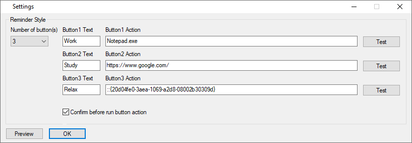

RReminder is a Windows utility written in [AutoHotkey](https://autohotkey.com/). It reminds you time every whole and half hour.

## Screenshots ##
You will get a pop-up window reminder every 30 minutes:

Or you can choose to get a toast notification:

Customizable button texts and actions:

## Help ##
For the button actions, you can run a document, URL, executable file (.exe, .com, .bat, etc.), shortcut (.lnk), or you can leave it blank. Some advanced examples can be found [here](https://www.autohotkey.com/docs/commands/Run.htm#ExBasic).

## Download ##
You can download the compiled standalone executable `RReminder.exe` [here](https://github.com/chaohershi/rreminder/releases). No installation required.

Alternatively, you can download the source code and run the script `RReminder.ahk` having AutoHotkey installed.

**Please be aware that you may get a popup message from Windows SmartScreen when running the executable.** The message would state that "Windows Defender SmartScreen prevented an unrecognized app from starting." This is totally normal. It takes some time for a new certificate, like the one that RReminder is using, to get recognized. Nevertheless, RReminder is free and minimal and contains no malware of any kind. Feel free to do a virus scan if you are worried!

To run RReminder from Windows SmartScreen, click on the "More info" link and then click on the "Run anyway" button.  

## License ##
RReminder is available under the MIT License.  
RReminder icon made by [Pavel Kozlov](https://www.flaticon.com/authors/pavel-kozlov) from [Flaticon](https://www.flaticon.com/free-icon/bell-ring-alarm_70084) is licensed by [CC 3.0 BY](https://creativecommons.org/licenses/by/3.0/).
